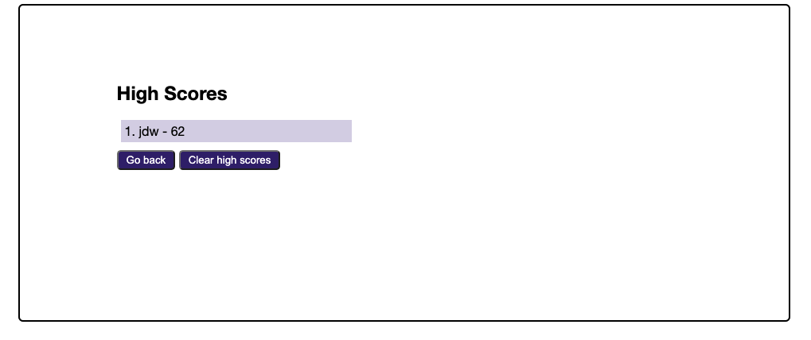

# JavaScript 'Basics' Coding Quiz

## Description
This application provides a beginning javascript developer with a few coding questions and an opportunity to see javascript at work.  It includes a timer and multiple choice questions and provides the user their score and an opportunity to submit it to a high scores list.  Only the top 5 high scores are maintained, at this time, and each is for a unique user/set of initials.  New users will be added, as they reach the top 5 and current users, in the top 5 scores, may have their high score updated, should they surpass their previous score.  The application is built to wort the scores from highest to lowest and delete scores lower than the top 5 from local storage.  This application is not currently available for use across devices.

## Page Link

https://sherriw.github.io/js-code-quiz/

## Table of Contents

- [JavaScript 'Basics' Coding Quiz](#javascript-basics-coding-quiz)
  - [Description](#description)
  - [Page Link](#page-link)
  - [Table of Contents](#table-of-contents)
  - [Built With](#built-with)
  - [Code Link](#code-link)
  - [Visuals](#visuals)
  - [User Story](#user-story)
  - [CRITERIA](#criteria)
  - [Installation](#installation)
  - [Usage](#usage)
  - [Support](#support)
  - [Roadmap](#roadmap)
  - [Contributions & Acknowledgements](#contributions--acknowledgements)
  - [Credits](#credits)
  - [License](#license)

## Built With
- HTML
- CSS
- JavaScript
- Web APIs

Code was created using Visual Studio Code and HomeBrew.

## Code Link

https://github.com/SherriW/js-code-quiz

## Visuals

Main Page
  
  
  
  

## User Story

AS A coding student or developer

- I WANT to take a timed quiz on JavaScript fundamentals that stores high scores
  - SO THAT I can gauge my progress conpared to my peers.

## CRITERIA

- GIVEN THAT I am taking a code quiz
  - WHEN I click the start button
    - THEN a timer starts and I am presented with a question
  - WHEN I answer a question
    - THEN I am presented with another questions
  - WHEN I answer a question incorrectly
    - THEN time is subtracted from the clock
  - WHEN all questions are answered or the timer reaches 0
    - THEN the quiz is over
  - WHEN the quiz is over
    - THEN I can save my initials and score
  - WHEN friends take the quiz with me
    - THEN the top 5 users' high scores are saved
  - When a current user gets a better score and is in the top 5
    - Then their score will be updated and displayed if they remain in the top 5.

## Installation

The application/site can be displayed in a web browser and was built mobile first to be responsive to a variety of devices and screen sizes.

## Usage
For personal, non-commercial, and educational use and participating developer(s) portfolio purposes.

## Support
Contact:  Sherri Winslow
Email:  swinslowcoding@gmail.com

## Roadmap

Initial: 

- Five question quiz on basic javascript information, timer, ability to sort scores, save high scores for up to 5 inidividuals, and update high score by add/drop of an individual with a higher score that is a new player, or updating a current player's score.

Future features:

- Add more questions to quiz
- Update the difficult of questions
- Develop for use with multiple devices.

## Contributions & Acknowledgements
Although, contributions are not allowed, at this time.  You may send any feedback on the code to swinslowcoding@gmail.com.  Any questions you would like to see added to the Basic Javascript Quiz, for more advanced quizzes, or for other types of coding, please feel free to forward them or share your own quiz.

## Credits
Developer: Sherri Winslow.
Acknowledgements:  I would like to express my appreciation to my Tutors - John Hernandez & Sandra Smith; Instructor - Dan Seskey; and TAs - Matt Torcellini, Symone Varnado, Nathan Sartain, and Jaime Montero who have been instrumental in keeping me on track and supporting me, while providing a quality education through UConn.

Developer:
- Sherri Winslow
  
## License
For Educational purposes and Portfolio use.  Feel free to enjoy the quiz: clone the code, review it and learn how it was built, add your own questions to your copy and make the questions more difficult.  

©2021 Sherri Winslow